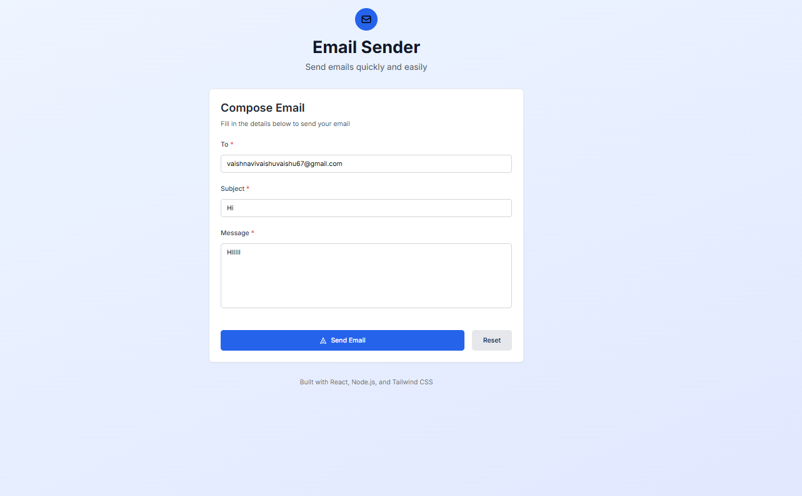

# Email Sender App (Full Stack)

A full-stack email sender application built with React frontend and Node.js backend.

## Features

- 📧 Send emails with To, Subject, and Message fields
- 🎨 Beautiful UI with Tailwind CSS
- 🔔 Success/Error toast notifications
- ✅ Form validation
- 🔄 Loading states
- 🌐 CORS enabled for development
- 🔒 Input sanitization and validation
## Screenshot 

## Tech Stack

### Backend
- **Node.js** - Runtime environment
- **Express.js** - Web framework
- **Nodemailer** - Email sending service
- **CORS** - Cross-origin resource sharing
- **dotenv** - Environment variables

### Frontend
- **React** - UI library
- **Vite** - Build tool
- **Tailwind CSS** - Styling
- **Axios** - HTTP client
- **React Hot Toast** - Notifications

## Project Structure

```
email-sender-app/
├── backend/
│   ├── index.js          # Main server file
│   ├── .env              # Environment variables
│   └── package.json      # Backend dependencies
├── frontend/
│   ├── src/
│   │   ├── App.jsx       # Main React component
│   │   ├── main.jsx      # React entry point
│   │   └── index.css     # Tailwind CSS styles
│   ├── public/
│   │   └── email-icon.svg # App icon
│   ├── index.html        # HTML template
│   ├── package.json      # Frontend dependencies
│   ├── vite.config.js    # Vite configuration
│   ├── tailwind.config.js # Tailwind configuration
│   └── postcss.config.js  # PostCSS configuration
└── README.md
```

## Setup Instructions

### 1. Clone and Navigate

```bash
cd email-sender-app
```

### 2. Backend Setup

```bash
# Navigate to backend directory
cd backend

# Install dependencies
npm install

# Configure environment variables
# Edit .env file with your email credentials
```

### 3. Frontend Setup

```bash
# Navigate to frontend directory (from root)
cd frontend

# Install dependencies
npm install
```

### 4. Email Configuration

Edit `backend/.env` file with your email service credentials:

#### Option A: Using Ethereal Email (Recommended for Testing)
1. Go to https://ethereal.email/
2. Click "Create Ethereal Account"
3. Copy the credentials and update `.env`:

```env
SMTP_HOST=smtp.ethereal.email
SMTP_PORT=587
SMTP_USER=your-ethereal-email@ethereal.email
SMTP_PASS=your-ethereal-password
```

#### Option B: Using Gmail
1. Enable 2-factor authentication on your Gmail account
2. Generate an App Password:
   - Go to Google Account settings
   - Security > 2-Step Verification > App passwords
   - Generate a new app password
3. Update `.env`:

```env
SMTP_HOST=smtp.gmail.com
SMTP_PORT=587
SMTP_USER=your-gmail@gmail.com
SMTP_PASS=your-app-password
```

### 5. Running the Application

#### Terminal 1 - Backend
```bash
cd backend
npm run dev
```
The backend will run on: http://localhost:5000

#### Terminal 2 - Frontend
```bash
cd frontend
npm run dev
```
The frontend will run on: http://localhost:3000

## API Endpoints

### Backend API

- `GET /` - API information
- `GET /health` - Health check
- `POST /send-email` - Send email

#### Send Email Request Body
```json
{
  "to": "recipient@example.com",
  "subject": "Test Subject",
  "message": "Test message content"
}
```

#### Response Format
```json
{
  "success": true,
  "message": "Email sent successfully!",
  "messageId": "unique-message-id",
  "previewUrl": "https://ethereal.email/message/preview-url"
}
```

## Development Features

### Frontend Features
- **Form Validation**: Real-time validation with error messages
- **Loading States**: Visual feedback during email sending
- **Toast Notifications**: Success/error messages
- **Responsive Design**: Works on all device sizes
- **Reset Functionality**: Clear form with one click

### Backend Features
- **Input Validation**: Server-side validation for all fields
- **Error Handling**: Comprehensive error handling with meaningful messages
- **CORS Support**: Configured for frontend development
- **Logging**: Request and error logging
- **Health Check**: Endpoint for monitoring

## Environment Variables

### Backend (.env)
```env
# SMTP Configuration
SMTP_HOST=smtp.ethereal.email
SMTP_PORT=587
SMTP_USER=your-email@ethereal.email
SMTP_PASS=your-password

# Server Configuration
PORT=5000
NODE_ENV=development
FRONTEND_URL=http://localhost:3000
```

## Scripts

### Backend
- `npm start` - Start production server
- `npm run dev` - Start development server with nodemon

### Frontend
- `npm run dev` - Start development server
- `npm run build` - Build for production
- `npm run preview` - Preview production build

## Troubleshooting

### Common Issues

1. **Email not sending**
   - Check your SMTP credentials in `.env`
   - Verify internet connection
   - Check if Gmail 2FA and App Password are set up correctly

2. **CORS errors**
   - Ensure backend is running on port 5000
   - Check `FRONTEND_URL` in `.env`

3. **Frontend not loading**
   - Ensure all dependencies are installed
   - Check if port 3000 is available

4. **Network errors**
   - Verify backend is running
   - Check API_BASE_URL in frontend App.jsx

## Production Deployment

### Backend
1. Set environment variables on your hosting platform
2. Change `NODE_ENV` to `production`
3. Update `FRONTEND_URL` to your production domain

### Frontend
1. Update `API_BASE_URL` in `App.jsx` to your backend URL
2. Run `npm run build`
3. Deploy the `dist` folder to your hosting platform

## License

This project is open source and available under the [MIT License](LICENSE).

## Contributing

1. Fork the project
2. Create your feature branch (`git checkout -b feature/AmazingFeature`)
3. Commit your changes (`git commit -m 'Add some AmazingFeature'`)
4. Push to the branch (`git push origin feature/AmazingFeature`)
5. Open a Pull Request

---

**Happy Emailing! 📧**
